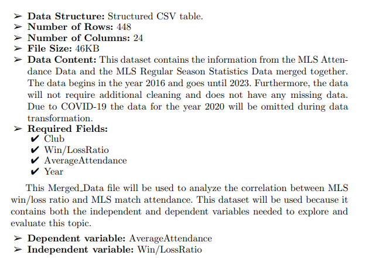
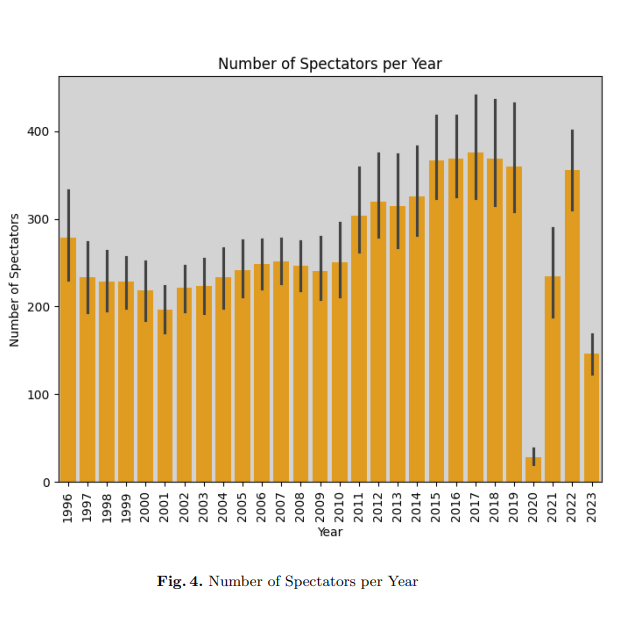
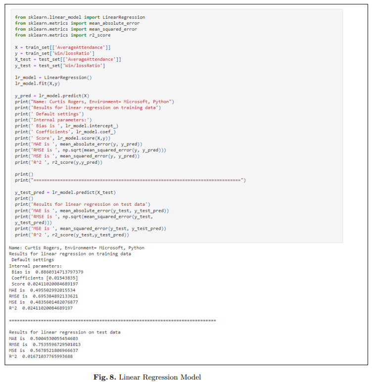
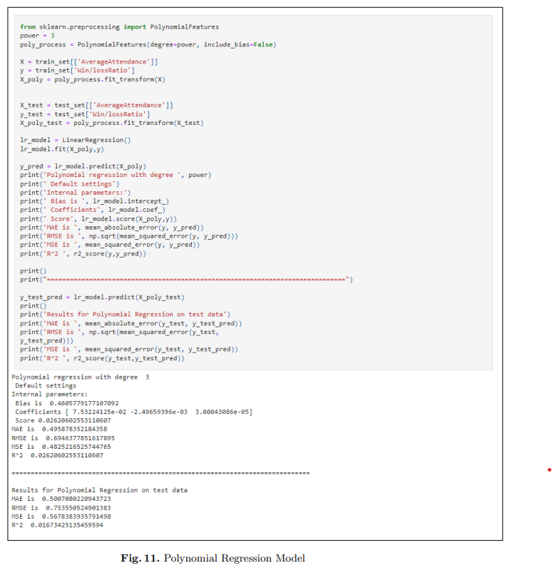
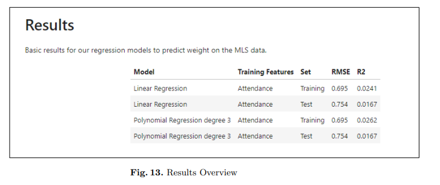

# capstone-project
NWMSU Capstone Project: Analysis of MLS data.
## Project Overview
This project is to identify if there is a correlation between MLS win/loss ratio and match attendance. In order to investigate this topic MLS yearly club stats will be used to determine a win/loss ratio for each year. To calculate this ratio the total number of regular season wins will be divided by the total number of regular season losses. This ratio will be analyzed using advanced analytical techniques to determine if there is a correlation between win/loss ratio and the average match attendance.
## Data Used
 To fully investiget this question, data will be pulled from two different web sources. Both datasets contain unique information that will play a vital throughout this project. The following sections will take a deeper look at both of these datasets and the elements contained within them. 
### Links to Data Sources
https://www.transfermarkt.us/major-league-soccer/besucherzahlen/wettbewerb/MLS1
https://www.mlssoccer.com/stats/clubs/#season=2024&competition=mls-regular-season&statType=general

This data was cleaned and transformed following the steps that can be found in the MLS-Capston.ipynb. The final result of the transformed data can be seen in the merged_df

### merged_df breakdown

### Exploratory Data Analysis

The following outline has been used to to explore
the datasets related to this project.
➢ Import the data
➢ Investigate and define columns
➢ Investigate the distribution of data
➢ Look for outliers in the data
➢ Look for and create a plan to address any missing data
➢ Data transformations
➢ Investigate variables that could influence this project topic
➢ Import the data
➢ Investigate and define columns
➢ Missing data
➢ Data transformations

While executing the EDA steps a large outlier was identified. The data from the year 2020 was omitted because this was during the COVID-19 pandemic. The match attendance for this year was significantly low and would skew the results. Below you can see a visual depicting this outlier.

## Machine Learning Models

This project will investigate these variables using 2 different machine learning models. The first is a Linear Regression Model, and 
the second is a Polynomial Regression Model. All execuded code, charts and results for these models can be found in section 7 through section 12 in the MLS-Capstone.ipynb.

### Linear Regression Overview

The following code was used to investigate the correlation between the two variables using a Linear Regression Model.

### Polynomial Regression Overview
The following code was used to investigate the correlation between the two variables using a Polynomial Regression Model.

## Reporting results

The full report along with the results can be found with the following link.

https://www.overleaf.com/read/fqjhfgshtvxf#74279b

This report explains all procedures used to investigate this correlation. This report outlines all data cleaning steps, project limitations, and the final results. 

### Overview of reults

At the end of this project it was concluded that there is no correlation between the 2 variables.

